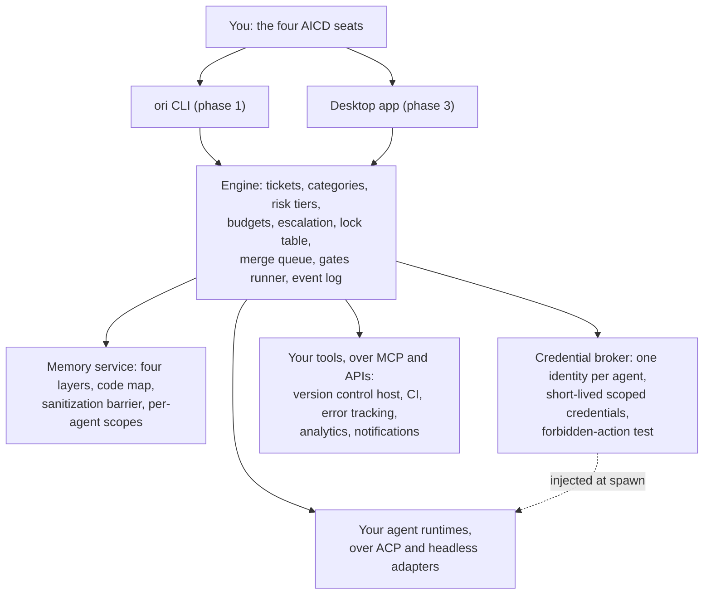

# Ori Studio

An open source, local first desktop workspace and engine for running a software
product under AICD, a methodology in which AI agents build, test, operate and
document software, and humans specify, verify, decide and supervise.

Ori Studio is not an agent and not a code editor. It is meant to be the layer
above your agents: the thing that gives them roles, separated permissions,
tickets, risk tiers, gates and memory, and gives you one place to supervise
them. By design it drives the agent runtimes you already use, connects to the
tools you already have, uses your own model keys, and operates no server of its
own.

**None of that works yet.** This is phase 1 of five, and phase 1 has barely
started. What a clone gets you today is a specification, the methodology, and a
workspace of sixteen crates that compile and do nothing. Read
[Status](#status) before you go further.

## The problem

Existing agentic tools (Kiro, Cursor, Claude Code, Codex and the rest) have
converged on the same feature set: specifications, subagents, hooks,
automations. None of them has an organization layer. That layer is:

- roles with separated permissions, enforced by the tool rather than by a prompt
- risk tiers that decide what may merge without a human
- an escalation protocol with defined triggers
- a migration procedure for a product that already exists
- a memory that distinguishes what the user decided from what an agent inferred

Without it, AICD is applied by hand, and applying it by hand currently takes a
four week bootstrap per product: reverse engineer the codebase, write the agent
instruction files, install the CI gates, configure a ticket system, wire
observability, set up permissions. Every team that wants AICD does that again,
and gets it slightly wrong. The methodology's controls live in documents and
conventions that a tool could enforce and no tool does.

The argument is made in full in
[`spec/PROJECT_BRIEF.md`](spec/PROJECT_BRIEF.md) section 1.

## Who it is for

An engineer with system design experience who supervises AI agents building and
maintaining production software, and who does not write code by hand. In AICD's
terms, the architect, verification lead, reliability and governance, and product
owner seats. Today that is often one person holding all four, so the tool has to
work for one person and grow to a team of several without rework.

Secondarily: a product owner without an engineering background, who talks only
to the assistant and reads the product signal view; and an auditor or a new team
member who needs to read the specification, the decisions and the evidence
behind any change.

### Not for

Developers who want an AI assisted code editor. **Ori Studio does not edit code
and will not become an editor.** That sentence is
[`spec/PROJECT_BRIEF.md`](spec/PROJECT_BRIEF.md) section 2's, and section 6
lists code editing under "Out of scope for the first release, and non-goals"
with the note "Not in the first release, not ever." It is a non-goal and not a
deferral. Anyone who wants to hand edit generated code should use a different
tool.

## Status

The roadmap has five phases. This tree is in phase 1: the headless engine and
the CLI, with no UI. Phase 1 is not close to done. What follows is what a clone
actually contains today, not what the roadmap describes.

| | Today |
|---|---|
| Specification | Written. The registry in [`spec/README.md`](spec/README.md) lists 24 documents with an owner seat and a state. Most carry the state Draft, and phase 1 cannot launch until the foundation set is approved. |
| Methodology | Present: `methodology/AICD_Methodology_v0.3.html`, with a generated machine readable section index at `methodology/sections.json`. |
| Engine code | Sixteen crates under `crates/`, plus a desktop scaffold at `apps/desktop/`. Almost all of them are a `Cargo.toml` and one source file holding a doc comment that names what the crate will own and which AICD sections it implements, and nothing else. The one exception is `ori-gates`, which contains the generator for the methodology section index. |
| Tests | 31, all in `ori-gates`, and all covering that section index generator. Every other crate has none, because there is nothing in them yet to test. |
| The `ori` binary | Builds. Its `main` is empty. |
| Desktop app | Directory structure and READMEs only. There is no Tauri dependency, no `package.json` and no UI code. The application is phase 3. |
| CI | There is no CI workflow in this repository yet. `scripts/gates.sh` is what exists, and it has a local runner for 2 of the 14 required gates. |

**One thing that will mislead you if nobody says it.** After
`cargo build --workspace`, the binary at `target/debug/ori` exists, runs, prints
nothing at all, and exits `0`. That is an empty `fn main()`, not a command that
succeeded. The CLI's commands are batch 14 of phase 1 in
[`spec/ROADMAP.md`](spec/ROADMAP.md); none of them is written. Do not read that
exit status as the tool working.

The phases, their deliverables and their exit criteria are in
[`spec/ROADMAP.md`](spec/ROADMAP.md), which is the authority. In one line:
headless engine and CLI, then the fleet, then the desktop app, then unattended
operation, then Ori Studio brought under AICD through itself.

## The shape it is being built into



The engine is the product; the CLI and the desktop app are thin clients of it,
and the same engine runs headless on a server or in CI. Source:
[`spec/PROJECT_BRIEF.md`](spec/PROJECT_BRIEF.md) section 3 and principle 1.

Inside Ori Studio, every one of those boxes is a skeleton today. The engine, the
memory service, the broker and the CLI are crates with no implementation in
them, and the desktop app is a directory tree with no application in it.

## Its relationship to AICD

AICD is a separate document with its own life, and Ori Studio implements it
rather than defining it.

A copy of the methodology ships inside this repository, at
`methodology/AICD_Methodology_v0.3.html`, so that agents and humans cite the
same text and a citation gate can check every `AICD §n` reference against the
generated index in `methodology/sections.json`. The index exists; the gate that
consumes it is gate 9 of [`spec/CI_CD.md`](spec/CI_CD.md) section 1, which is
specified, ticketed and not yet installed. Each release of Ori Studio names the
AICD version it is built under. This tree is built under v0.3.

The specification under `spec/` is the source of truth, and the code is its
build artifact. That is the operating rule of this repository rather than a
statement about documentation: a behavior the specification does not describe is
a change to the specification first, and a behavior the methodology does not
describe is a change proposal to the methodology first. It is also why `spec/`
is considerably fuller than `crates/`.

## Where to look

| Read this | For |
|---|---|
| [`spec/PROJECT_BRIEF.md`](spec/PROJECT_BRIEF.md) | The one document to read first. The problem, the users, the scope, the non-goals, the principles, the risks. Everything else derives from it. |
| [`spec/README.md`](spec/README.md) | The specification registry: every document, its set, its owner seat and its state. Start here to find out whether the document you want exists yet. |
| [`spec/ROADMAP.md`](spec/ROADMAP.md) | The five phases, what each delivers, and the exit criteria each has to meet. |
| [`spec/ARCHITECTURE.md`](spec/ARCHITECTURE.md) | The components and how they fit together. |
| [`CLAUDE.md`](CLAUDE.md) | How agents work in this repository: the rules every role obeys, the escalation triggers, and how a ticket is worked. Read it before sending an agent at this tree. |
| `methodology/AICD_Methodology_v0.3.html` | The methodology itself. |

## Building it today

You need git and rustup already installed; the setup script reports those two as
missing rather than installing them, and handles the rest itself.

```sh
git clone <this repository>
cd <the clone>
scripts/setup-dev.sh
cargo build --workspace
```

`scripts/setup-dev.sh` checks every requirement of
[`spec/ENV_SETUP.md`](spec/ENV_SETUP.md) section 1, installs what is missing and
what it can supply, and prints one line per requirement with an explicit state.
Some requirements are reported as `NOT YET`, meaning specified but not built,
each named with the ticket that will deliver it; the script counts those as
unmet and says so rather than passing over them, so a clean machine today ends
at `PASS WITH GAPS` and not at `PASS`. `scripts/setup-dev.sh --check-only`
verifies and installs nothing. `scripts/setup-dev.sh --help` lists the rest.

What `cargo build --workspace` produces is a workspace of crate skeletons that
compile. It is not a usable tool, and running the resulting binary does nothing,
as described under [Status](#status).

Before opening a pull request, run `scripts/gates.sh`. It reports a state for
every one of the fourteen gates in [`spec/CI_CD.md`](spec/CI_CD.md) section 1
and never omits one. Today it has a local runner for two of them; for the other
twelve it prints the reason it has none, because a gate that is silently skipped
is indistinguishable from a gate that passed.

## Contributing

There is no contributor guide yet, and the project is not set up to take patches
from outside.

What exists is the process the project runs on itself, in
[`CLAUDE.md`](CLAUDE.md): changes arrive as tickets with a declared scope, a
plan, a risk tier and a closing report, worked by an agent fleet in isolated
worktrees, and specification changes go through a separate documentation role
rather than being edited in place. Reading that file is the fastest way to
understand what the product is trying to be, because the repository is run by
the rules the product is meant to enforce.

To propose something, read [`spec/PROJECT_BRIEF.md`](spec/PROJECT_BRIEF.md) and
[`spec/ROADMAP.md`](spec/ROADMAP.md) first and say which phase your proposal
belongs to. A proposal that contradicts the brief is a change to the brief, and
that is a conversation worth having on its own.

## License

Apache 2.0 for the software. The AICD methodology document is CC BY 4.0. The
name AICD is protected by a trademark policy.

**There is no `LICENSE` file in this repository yet.** The statement above is
the one made by [`spec/PROJECT_BRIEF.md`](spec/PROJECT_BRIEF.md)'s header table,
and `Cargo.toml` declares `license = "Apache-2.0"` for the workspace. Until the
file exists, those two are the only record of it, and neither is the grant
itself. This is a known gap, not a considered choice.
