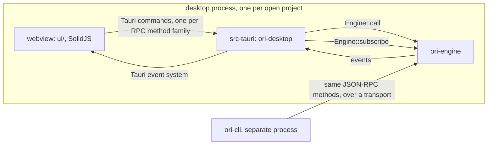

# apps/desktop

The Ori Studio desktop application: the surface a human supervises the fleet
through. `spec/LLD.md` section 1 places it here, `spec/LLD.md` section 3
describes its structure, and `spec/ARCHITECTURE.md` section 4 gives its process
model.

## State: scaffold, not an application

This directory is shape only. Ticket ORI-T-0002 creates it in phase 1, whose
goal in `spec/ROADMAP.md` is "the engine exists, enforces the methodology's
core, and the CLI exposes it. No UI." The desktop application itself is phase 3.

What exists today:

| Path | What it is now |
|---|---|
| `src-tauri/` | A workspace member, `ori-desktop`, that links `ori-engine` and contains no commands |
| `ui/` | The directory structure of `spec/LLD.md` section 3, each directory carrying a README that says what belongs in it |

What deliberately does not exist, and why:

| Absent | Reason |
|---|---|
| The `tauri` dependency | `spec/CONVENTIONS.md` makes adding a crate an escalation trigger. Tauri 2 belongs to the ticket that builds the application, in phase 3. Pulling its dependency tree into a phase whose goal is "No UI" adds build cost, supply-chain surface and an audit obligation for something this phase cannot exercise. |
| `tauri.conf.json`, icons, bundle configuration | Same ticket. A Tauri configuration without Tauri is a file nothing reads. |
| `package.json`, `node_modules`, any JavaScript dependency | `spec/ENV_SETUP.md` section 1 names Node LTS and pnpm for the UI build only, and marks them "never a runtime dependency of the engine". That build is phase 3. |
| Any Tauri command | `spec/RISK_MAP.md` tiers `apps/desktop/src-tauri (commands)` at 1. There is nothing to wrap yet: the RPC method families they forward to are built in batch 13 of phase 1. |
| `vite.config.ts`, `tsconfig.json`, `index.html` | Part of the UI build, phase 3. |
| `ui/src/tokens.css` | `spec/design/DESIGN.md` section 2 names this path as the source of truth for the design tokens and carries the values extracted from DSN-001. Writing them here in phase 1 would create a second copy that no build reads and no test compares against DESIGN, so the two could diverge with nothing to catch it. The phase 3 ticket that introduces the UI build authors the file; until then `spec/design/DESIGN.md` section 2 is the readable record. |

## Process model

From `spec/ARCHITECTURE.md` section 4 and `spec/LLD.md` section 3. One process:
the Tauri backend hosts the engine, the webview runs the UI, and they talk
through Tauri commands that wrap the same JSON-RPC methods the CLI calls, so the
UI has no private path into the engine.

`spec/ARCHITECTURE.md` section 3 binds a window to exactly one project: several
projects mean several windows, each with its own engine, database, worktrees,
containers, MCP sessions and agent identities. That is AICD §26's rule, "one
fleet instance per product", and "fleets never share credentials or context",
applied to windows.

## Risk tier

`spec/RISK_MAP.md` tiers `apps/desktop/src-tauri (commands)` at 1 ("thin
wrappers") and `apps/desktop/ui` at "0 for styling and layout, 1 for anything
that sends an RPC". Under lead ruling R11, a ticket is tier 2 when its declared
scope touches a RISK_MAP tier 2 path; this one does not. Tier 1.
