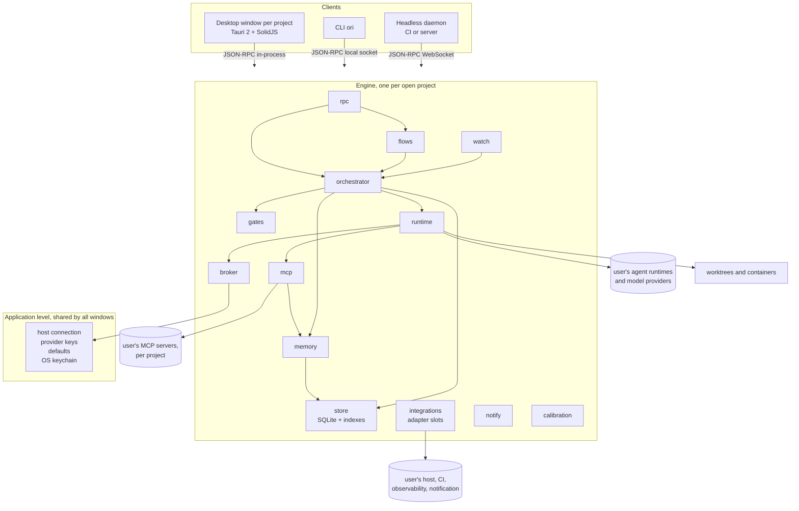

# ARCHITECTURE: Ori Studio

Derives from PROJECT_BRIEF and ADR-0001. Describes the system's components, how they communicate, the process model, data flows, deployment topology and update strategy. Module-level detail is in LLD; entities in DATA_MODEL; the interfaces in API_SPEC.

## 1. Overview

One engine, three clients, no server.

The engine is a library crate. The desktop app links it and calls it in-process. The CLI and the headless daemon run the same library behind a socket. Every capability exists in the engine; the clients render and forward.

## 2. Components

| Component | Responsibility | Methodology sections |
|---|---|---|
| **rpc** | JSON-RPC API and event subscription for clients; authentication of local clients; versioned schema | 28 (dashboard), API_SPEC |
| **orchestrator** | Ticket lifecycle, categories, tiers, budgets, blocked reports, escalation triggers, lock table, merge queue, closing rules | 11, 12, 13 |
| **flows** | Guided procedures: new product (G0 to G7), migration (M0 to M5), document generation and approval, readiness computation, phase start and close | 23, 24 |
| **gates** | Gate definitions, runners, planted-defect proving, coverage matrix, modified-test detection, significance labeling, liveness | 14, 15 |
| **watch** | Working tree and repository watcher; attribution of every change to an agent session or a human; unattributed-change incidents; merge block | Lessons (39), PRD Z-01 |
| **store** | SQLite, event log (append-only), projections, schema migrations, per-product database file | 8 (layer 3) |
| **memory** | The four layers, repository indexer, code map, operational log, sanitization barrier, scope enforcer, retrieval API, freshness | 8, 25 |
| **broker** | Agent identities, credential issuance, keychain access, the forbidden-action test, audit of every issuance | 17, 27 |
| **runtime** | Agent sessions: spawn in worktree or container, credential injection at spawn, ACP client, headless adapters, model routing per role, budgets enforcement, session transcripts | 7, 12 |
| **mcp** | MCP host toward the user's servers; MCP server toward agents exposing memory retrieval, ticket operations and evidence access under scopes | 25 |
| **integrations** | Adapter traits and reference adapters for the five slots; webhook receiver; polling | 16, brief principle 12 |
| **notify** | Routing rules (interrupt versus review window), desktop notifications, notification slot, digest | 28, PRD N-01 |
| **calibration** | Calibration sets, measurements, thresholds as multiples, re-run prompts | 21, 30 |

## 3. Instances, windows and configuration scopes

Ori Studio runs one **engine per open project**. A desktop window binds to exactly one project; opening several projects opens several windows (or instances), each with its own engine, database, worktrees, containers, MCP sessions and agent identities. Nothing crosses projects except application-level configuration.

| Scope | Holds | Stored |
|---|---|---|
| Application | Version control host connection (one app-scoped identity), model provider keys, default model per role, notification defaults, container runtime choice, organizational repository location | OS keychain (secrets) and the application config file |
| Project | Everything in `spec/` and `ops/`, agent identities, MCP server connections and their role exposure, integration slots for the four project-level categories, provider key overrides, model per role overrides, seats, routes, data classification | Repository (durable) and the project database (rebuildable) |

A project's MCP sessions are opened by that project's engine and exposed to that project's agents only. The host connection is application-level because identities are issued per repository from one app installation; provider keys are application-level because they are the operator's, with a per-project override for a project that must use a different key or provider.

## 4. Process model

- **Desktop app:** one process. The Tauri backend hosts the engine; the webview runs the UI; they talk through Tauri commands that wrap the same JSON-RPC methods, so the UI never has a private path into the engine.
- **CLI:** connects to a running daemon if one owns the product's socket; otherwise starts an ephemeral in-process engine for the command.
- **Daemon:** `ori daemon --product <path>` owns the product's SQLite file and socket. Exactly one engine writes a product's database at a time; a lock file enforces it.
- **Agent sessions:** child processes of the engine, one per session, each in its own worktree and, by default, its own container, launched in the runtime's non-interactive (auto) mode: no permission prompts exist because the isolation boundary and the issued credentials are the permission. The engine is the only process holding credentials; each child receives only the scoped, short-lived credentials the broker issues for its identity, as environment or mounted files at spawn, never afterward.
- **Unattended agents** (QA, operations, documentation, product signal) are the same runtime, launched by the daemon on triggers (events, schedules) instead of by an operator.

## 5. Data flows

### 5.1 A ticket, end to end
1. A ticket is created (by the operator, a flow, or an agent through MCP) and stored as an event.
2. The orchestrator categorizes (or validates the agent's proposal), assigns a tier from RISK_MAP, and, if validated, queues it.
3. The lead session pulls the queue, checks the lock table against the ticket's declared scope, assigns a coder identity.
4. The runtime spawns the coder in a worktree (and container) with broker-issued credentials; memory serves the context package under the coder scope.
5. The coder produces plan, commits, tests, and a pull request through the vcs adapter. Every action is an event with the identity.
6. Gates run (CI adapter, local runners); results are events.
7. The lead session reviews through the adversarial checklist; escalates or approves. Escalations become cards.
8. Tier rules decide who may merge; the merge queue rebases and re-runs gates; merge is an event.
9. Post-merge: significance label, documentation agent session, closing report to memory, notifications.

### 5.2 Unattributed change
The watcher receives file-system events and git events (hooks installed in the repository, plus polling of refs). Each change is matched against active sessions (identity, worktree, ticket) and against human edits in `spec/` through Ori Studio. A match records attribution. No match raises an `UnattributedChange` event, the orchestrator opens an incident ticket, the merge queue blocks the affected branch, notify interrupts the operator.

### 5.3 Memory retrieval
An agent asks the MCP server for context for its ticket. The scope enforcer resolves the identity's role, the retrieval API assembles a bounded package from the indexes (canonical, organizational, operational, code map), tags every item with provenance and verification date, and returns it. Production-derived records were already passed through the sanitization barrier when written; raw evidence is only returned on explicit request for that ticket, labeled untrusted.

### 5.4 Document generation and readiness
The flows component drives the assistant session with the document templates and the approved brief; each generated document is written to `spec/` on a specification branch and appears as a review item; approval is an event; readiness is a projection over document states, RISK_MAP coverage, permission manifest completeness and broker test results.

## 6. Repository and specification layout the engine expects

The engine reads and writes a product repository with the layout the methodology defines: `spec/` (canonical knowledge, editable by humans), `ops/` (operational memory as structured files), `methodology/` (the AICD HTML and its machine-readable section index, at the version the project runs), the agent instruction files, and the organizational repository for layer 2. The SQLite file and indexes live outside the repository in the user's application data directory and are rebuildable from the repository.

## 7. Deployment topology

- **Local:** the desktop app on the operator's machine, with worktrees under the repository's parent and containers on the local container runtime.
- **Unattended (phase 4):** the daemon on a server or in CI runners, headless, reached over WebSocket with token authentication, running the unattended agents against staging. Same binary.
- **Continuous test environment:** provisioned by the user; the engine only orchestrates runs against it through the CI slot and the runtime.

## 8. Update strategy

- The engine's SQLite schema is versioned; migrations run forward on open and are tested against fixtures from every prior version.
- The JSON-RPC API is versioned; clients declare the version they speak; the engine supports the current and previous minor.
- The AICD version a product runs is recorded in its repository; the engine implements a stated methodology version and refuses to open a product on a newer one without an explicit upgrade flow.
- Desktop updates through the Tauri updater with approved manifests; the CLI through the package managers; both from one release pipeline (CI_CD).

## 9. Boundaries that are architectural rules

- The UI has no capability the CLI lacks; both go through rpc.
- Only the broker issues credentials and reads the keychain; only the runtime injects an issued credential at spawn and holds it no longer than the session; nothing else touches a credential.
- Only the runtime spawns processes; only the watch component reads the working tree outside a session.
- Only the merge queue merges; no adapter exposes a merge operation directly.
- Only the memory component writes to operational memory; agents write through the MCP server, never to files directly.
- Nothing in the engine calls the network except integrations, runtime (to the user's providers) and mcp (to the user's servers).
