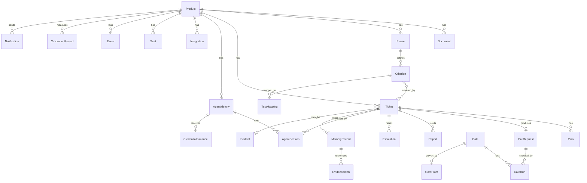
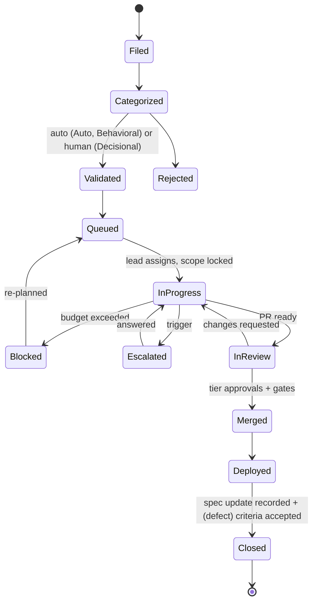
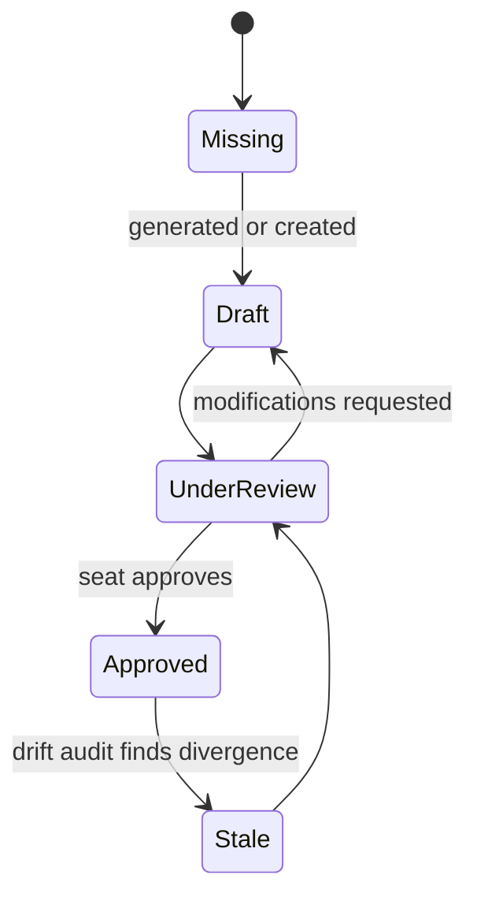

# DATA_MODEL: Ori Studio engine

Entities, relationships, invariants and state machines. The store is event-sourced: every change is an `Event`; the tables below are projections rebuilt from the log. Diagrams are Mermaid so agents and humans read the same thing.

## 1. Entity overview

## 2. Entities

Identifiers are ULIDs unless stated. Timestamps are UTC. "Immutable" means the row is never updated after creation; changes create new rows or events.

| Entity | Key fields | Notes |
|---|---|---|
| **Product** | id, name, repo_path, repo_remote, aicd_version, origin (new, migrated), created_at | One SQLite file per product |
| **Seat** | id, product_id, seat (architect, verification_lead, reliability_governance, product_owner), holder (human identity) | One human may hold several |
| **Document** | id, product_id, path (under spec/), kind (brief, prd, architecture, adr, data_model, api_spec, lld, conventions, security_notes, env_setup, permissions, testing, observability, ci_cd, roadmap, runbook, agent_instructions, risk_map, criteria, as_built_*), set (foundation, phase, migration), state, approved_by, approved_at, verified_against_code_at | State machine below |
| **Phase** | id, product_id, kind (roadmap, migration), key (P1.., M0..M5, G0..G7), title, state, exit_criteria (json), started_at, closed_at | Migration phases and roadmap phases share the entity |
| **Criterion** | id (human-readable, e.g. ORI-P1-014), product_id, phase_id, type (functional, security, performance, resilience, simulation), precondition, action, expected, tier, state (proposed, accepted, rejected, superseded), proposed_by (human or identity), accepted_by | Proposed criteria never enter the coverage matrix (methodology 15) |
| **TestMapping** | criterion_id, test_ref (path and name), source (ci parse) | Coverage matrix rows |
| **Ticket** | id, product_id, title, category, tier, state, spec_anchor, declared_scope (modules), budget (attempts, wall_clock_s, tokens), filed_by, phase_id, significance (bool, set at merge), incident_id (nullable) | State machine below |
| **Plan** | id, ticket_id, session_id, content, declared_scope, approved_by, approved_at | Immutable; a new plan supersedes |
| **PullRequest** | id, ticket_id, remote_ref, branch, tier, state (open, ready, changes_requested, approved, merged, closed), approvals (json: identity or human, time), rollback_plan | |
| **Escalation** | id, ticket_id, trigger (enum from methodology 12), question, recommendation, context_package_ref, state (open, answered), answered_by, answer, answered_at | Answers are audited decisions |
| **Report** | id, ticket_id, kind (closing, blocked, qa_run, drift_audit, incident, post_mortem), content, session_id | Immutable; also written to ops/ |
| **AgentIdentity** | id, product_id, role (coder, lead, qa, operations, documentation, product_signal, assistant), model, runtime (acp, headless), scopes (memory), permissions (json), state (active, suspended) | |
| **AgentSession** | id, identity_id, ticket_id (nullable for unattended), worktree, container_id, started_at, ended_at, budget_used (attempts, seconds, tokens), outcome (completed, blocked, escalated, killed) | Transcript stored as a file, referenced |
| **CredentialIssuance** | id, identity_id, session_id, scope, issued_at, expires_at, revoked_at | Never stores the secret |
| **Gate** | id, product_id, kind (lint, types, tests, coverage_matrix, mutation, dependency_audit, secret_scan, build, modified_tests, significance, liveness, citation), definition (json), state (defined, proven, installed, inert) | `installed` requires a GateProof |
| **GateProof** | gate_id, planted_defect_ref, passed_clean_at, failed_dirty_at, evidence_ref | Methodology 14 rule |
| **GateRun** | id, gate_id, pr_id (nullable), status (pass, fail, error, missing), output_ref, started_at, finished_at | `missing` is the inert case and is a failure |
| **MemoryRecord** | id, product_id, layer (operational), kind (closing_report, blocked_report, escalation_decision, incident, post_mortem, finding), structured (json, sanitized), provenance (source, identity, ticket, time), untrusted (bool) | Only typed records; free text length-capped |
| **EvidenceBlob** | id, record_id, content_ref (file), content_type, untrusted (true) | Never indexed |
| **Incident** | id, product_id, kind (slo_breach, unattributed_change, credential_leak, store_rejection, other), ticket_id, opened_at, resolved_at, resolution (json) | |
| **AppConfig** | singleton, host_connection (non-secret), default_models (json), notification_defaults, container_runtime, org_repo_path | Application level, shared by all projects |
| **ProviderBinding** | id, product_id (nullable = application default), provider, key_ref (keychain), roles (json) | Per-project override when product_id set |
| **McpServer** | id, product_id, name, transport, config (non-secret), credential_ref, exposed_to_roles (json) | Always project-scoped |
| **Integration** | id, product_id, slot (vcs_host, error_tracking, analytics, notification, ci), adapter, config (non-secret json), credential_ref (keychain key) | |
| **Notification** | id, product_id, kind, route (interrupt, window, digest), payload_ref, delivered_at, acknowledged_at | |
| **CalibrationRecord** | id, product_id, model, category, sample_size, first_pass_rate, median_tokens, median_attempts, median_seconds, measured_at, budget_multiple | |
| **Event** | seq (monotonic), product_id, at, actor (human identity or agent identity or system), kind, ticket_id (nullable), payload (json), hash_prev | Append-only, hash-chained: the audit trail |
| **LockEntry** | product_id, module, ticket_id, session_id, acquired_at | Lock table (methodology 12) |
| **UnattributedChange** | id, product_id, path, kind (edit, commit, push), diff_ref, detected_at, resolved_as (exception_ticket, revert), resolved_at | |

## 3. State machines

### Ticket

Invariants: category may be raised by an agent, lowered only by a human; a ticket cannot enter `Closed` without a `spec_update` event (or `no_change_needed`) and, if it is a defect, an accepted criterion referencing it; a ticket whose PR modified an existing test has an open `Escalation` before `InReview` can proceed.

### Document

Invariants: only the owning seat may sign; a foundation document in any state but `Approved` disables Launch.

### Phase
`Planned → Ready` (its document set approved) `→ Active → Closing` (all criteria covered, matrix complete, QA run clean) `→ Closed`. A phase cannot become `Active` unless the previous phase is `Closed` (roadmap) or its predecessor migration phase is `Closed`.

### AgentSession
`Spawning → Running → (Blocked | Escalated | Completed | Killed)`. On any terminal state, credentials issued to the session are revoked.

### Gate
`Defined → Proven` (GateProof present) `→ Installed`. A GateRun with status `missing` on an installed gate flips it to `Inert`, which is an incident.

## 4. Invariants across entities

- Every `Event` has an actor; `system` is allowed only for scheduled triggers and watchers.
- Every `PullRequest` merge event references the approvals that satisfied its tier, and for tier 2, two distinct approvers (or the single-operator profile's substitutes, recorded).
- Every `CredentialIssuance` is bound to one session and expires with it.
- `MemoryRecord.structured` never contains a field longer than the configured cap, and every record derived from an integration has `untrusted = true` provenance.
- `LockEntry` modules for two `InProgress` tickets never overlap.
- The SQLite file plus the repository fully reconstruct every projection; a `rebuild` command proves it in CI.
