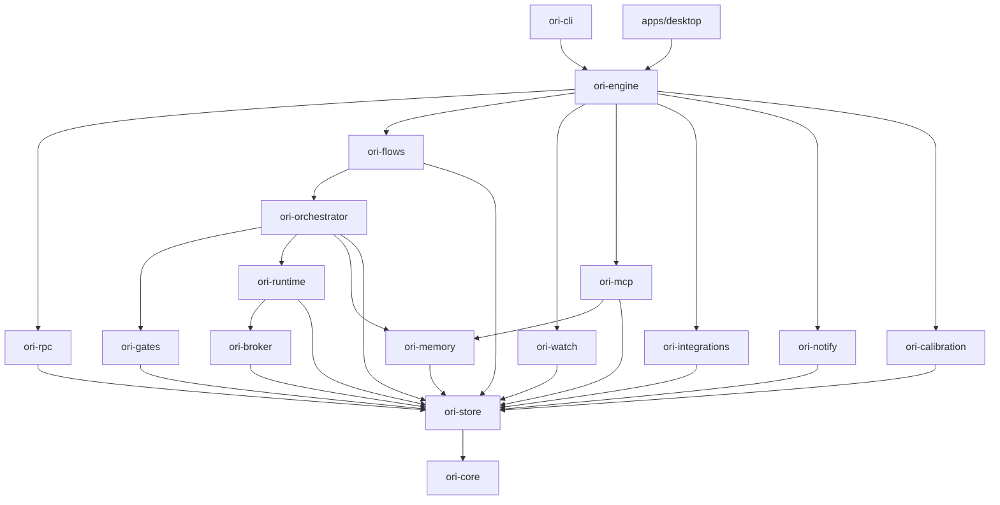

# LLD: Ori Studio

Low-level design: repository layout, crates, module responsibilities, naming, and the rules agents follow when adding code. Derives from ARCHITECTURE and ADR-0001.

## 1. Repository layout

```
ori-studio/
  Cargo.toml                 # workspace
  crates/
    ori-core/               # domain types, state machines, invariants, errors. No IO.
    ori-store/              # SQLite, event log, projections, migrations
    ori-memory/             # layers, indexer, code map, sanitization barrier, scopes, retrieval
    ori-broker/             # identities, credentials, keychain, forbidden-action test
    ori-runtime/            # sessions, worktrees, containers, ACP client, headless adapters
    ori-gates/              # gate definitions, runners, proving, coverage matrix, significance, liveness
    ori-orchestrator/       # ticket lifecycle, lock table, merge queue, escalation, budgets, closing rules
    ori-flows/              # new product, migration, document generation, readiness, phases
    ori-watch/              # working tree and git watcher, attribution, unattributed changes
    ori-mcp/                # MCP host (user servers) and MCP server (toward agents)
    ori-integrations/       # traits + reference adapters (one per slot) + webhook receiver
    ori-notify/             # routing, desktop notifications, digest
    ori-calibration/        # calibration sets, measurements, thresholds
    ori-rpc/                # JSON-RPC server, event subscriptions, transports
    ori-engine/             # composition root: wires the crates, exposes `Engine`
    ori-cli/                # `ori` binary
  apps/
    desktop/                 # Tauri 2 app: src-tauri/ (Rust, links ori-engine) and ui/ (SolidJS)
  spec/                      # this specification (canonical knowledge)
  methodology/               # AICD methodology HTML + section index, at the version the project runs
  ops/                       # operational memory as structured files
  templates/                 # methodology templates shipped with Ori Studio (documents, roles, tickets, ACP)
  profiles/                  # methodology profiles as configuration
  fixtures/                  # sample products for tests (new product, migrated with drift, inert gate, looping agent)
  scripts/                   # dev and release scripts
  .github/workflows/         # CI and release
```

## 2. Crate responsibilities and dependency direction

Dependencies point downward only. A crate may depend on those below it, never above or sideways unless listed.



| Crate | Owns | Must not |
|---|---|---|
| ori-core | `Product`, `Ticket`, `Document`, state machines as pure functions (`Ticket::apply(event) -> Result<Ticket>`), `Category`, `Tier`, `Role`, `Scope`, error enum with methodology-section reasons | Do IO, import any other workspace crate |
| ori-store | `EventLog` (append, hash chain, read range), projections, migrations, `ProductDb` open/lock | Contain business rules |
| ori-memory | `Layer`, `Indexer` (tantivy), `CodeMap` (tree-sitter), `Barrier` (sanitize), `ScopeEnforcer`, `Retrieval` (context package), `Freshness`, `DriftAudit`, `CitationChecker` | Return unsanitized production content in a package |
| ori-broker | `Identity`, `Issuance`, `Keychain` (keyring), `ForbiddenActionTest` | Persist secrets anywhere but the keychain |
| ori-runtime | `Session`, `Worktree`, `Container` (docker or podman CLI), `AcpClient`, `HeadlessAdapter` trait and implementations, `Budget` meter, `Transcript`, `Injector` (env or file at spawn) | Merge, write `spec/` or `ops/`, hold credentials beyond a session |
| ori-gates | `GateDef`, `Runner` trait, built-in runners (coverage matrix, modified tests, significance, citation, liveness), `Prover` (planted defect) | Report a gate installed without a proof |
| ori-orchestrator | `Lifecycle` (validated transitions), `LockTable`, `MergeQueue`, `Escalation`, `ClosingRules` | Call adapters directly except `VcsHost::merge` through `MergeQueue` |
| ori-flows | `NewProductFlow` (G0..G7), `MigrationFlow` (M0..M5), `DocumentGenerator` (templates + assistant session), `Readiness`, `PhaseControl` | Skip a approval |
| ori-watch | `TreeWatcher` (notify crate), `GitHooks` installer, `Attribution`, `UnattributedChange` | Modify the tree |
| ori-mcp | `Host` (client to user servers), `Server` (tools in API_SPEC section 3), `ToolScopes` | Expose a tool not in API_SPEC |
| ori-integrations | Traits in API_SPEC section 4, `reference/` adapters, `Webhooks` | Read the store |
| ori-notify | `Router` (interrupt, window, digest), `Desktop`, `Digest` | Bypass the router |
| ori-calibration | `Set`, `Measurement`, `Threshold` | Hard-code any absolute number |
| ori-rpc | `Server`, method registry, `Transport` (uds, named pipe, websocket), `Subscriptions` | Contain logic beyond validation and dispatch |
| ori-engine | `Engine::open(product)`, `Engine::call(method, params)`, `Engine::subscribe()` | |

The broker issues a credential; the runtime injects it at spawn and holds it no longer than the session.

## 3. Desktop app

- `apps/desktop/src-tauri`: Tauri commands are thin wrappers that forward to `Engine::call`; one command per RPC method family; events forwarded to the webview through Tauri's event system.
- `apps/desktop/ui`: SolidJS, Vite, TypeScript strict. Structure by screen (`screens/dashboard`, `screens/fleet`, `screens/tickets`, `screens/inbox`, `screens/map`, `screens/spec`, `screens/files`, `screens/terminal`, `screens/chat`, `screens/settings`, `screens/readiness`, `screens/migration`), shared `components/`, `rpc/` (typed client generated from API_SPEC), `store/` (Solid stores fed by events).
- Monaco is loaded lazily; read-only everywhere except documents under `spec/`.
- xterm.js connected to the `terminal.*` RPC; input is sent through RPC so it is logged.

## 4. Naming and structure rules

- Modules and files: snake_case. Types: UpperCamelCase. Events: `domain.verb_past` (`ticket.validated`, `gate.proven`).
- Every error that refuses an action includes `MethodologyRef { section: u8, subsection: Option<String> }` so the UI can show the "explain" action.
- Every diagram in code comments, docs and generated output is Mermaid; no ASCII diagrams.
- Every public function of a crate has a doc comment naming the methodology section it implements, checked by the citation gate.
- Tests live beside the code (`mod tests`) for units, in `crates/<crate>/tests/` for integration, and in `fixtures/` for end-to-end product fixtures. Every test name embeds the criterion identifier it covers (`ori_p1_014_launch_refused_when_brief_unapproved`).
- No `unwrap` outside tests; errors are typed; panics are bugs.
- Feature flags for the container backend and the vector index so the worktree-only and no-embeddings configurations build.

## 5. Concurrency model

Tokio runtime in the engine. The event log is written by a single writer task; all mutations are messages to it, so ordering and the hash chain are guaranteed. Projections update from the log in the same task. Reads are lock-free snapshots. Agent sessions are supervised tasks; killing a session revokes its credentials first, then terminates the process, then releases its locks, in that order.

## 6. Storage layout on disk

```
<app data>/ori/
  app.toml                 # application-level config (non-secret): host connection, defaults, org repo path
  products/<product_id>/
    product.sqlite           # event log + projections
    index/                   # tantivy segments, vectors
    sessions/<session_id>/   # transcripts, logs
    evidence/<blob_id>       # raw evidence, never indexed
    lock                     # single-writer lock
  keychain: OS keychain entries keyed by product and slot
```
Nothing in `<app data>` is required to reconstruct methodology-defined state; `products.rebuild` regenerates it from the repository and the event log, and the event log itself is exportable to `ops/` as structured files for backup.
