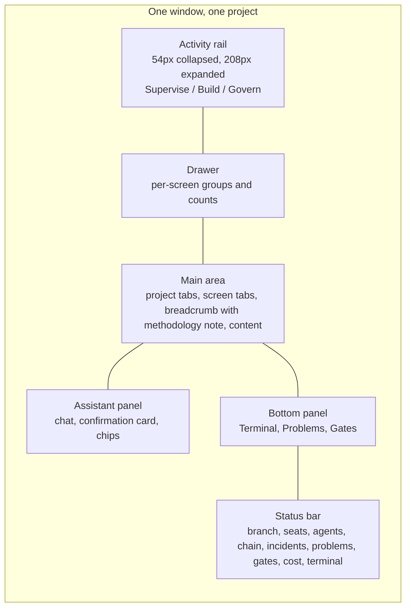

# DESIGN: Ori Studio

Gate G2 document (AICD §23, §33). Binds the visual reference `design/ori-studio-mockup-v1.html` (the Claude Design export) to the PRD and to API_SPEC, records the design tokens and rules an implementer needs, and lists what the reference does not yet show. The reference is a React mockup; Ori Studio's UI is SolidJS (ADR-0001). It is ported, not reused. The QA agent verifies the built UI against this document and the reference (structure, tolerance, accessibility, breakpoints).

## 1. Status of the reference

| Design ID | File | Covers | State |
|---|---|---|---|
| DSN-001 | `design/ori-studio-mockup-v1.html` | Shell, 18 screens, assistant panel, bottom panel, settings (9 tabs) | Reference, approved for layout and tone; not a complete flow set (section 6) |

## 2. Design tokens (extracted from DSN-001; the source of truth is `ui/src/tokens.css`)

| Token | Value | Use |
|---|---|---|
| `--accent` | #9184d9 | Primary actions, active navigation, decisional |
| `--accent-soft` | #d2cefd | Accent text on dark panels |
| `--good` | #7fc59a | Healthy, covered, approved, tier 0 |
| `--warn` | #e0b67f | Attention, behavioral, tier 1, stale |
| `--bad` | #e06c6c | Incident, refused, tier 2, interrupt |
| `--dim` | #75798c | Idle, locked, secondary text |
| `--text` | #e9e9ed | Primary text |
| `--text-2` | #b2b6ca / #9397ab | Secondary and tertiary text |
| `--panel` | #232532 | Active tab, cards |
| `--panel-2` | #2a2d3d | Value chips |
| `--line` | #3f424d | Borders, inset marks |
| Tier chips | 0: #292b31 / #cfd3e5; 1: #423a6a / #e7e5fe; 2: #4a2f33 / #f0c4c4 | Background / foreground |
| Category chips | Auto #2a2d3d; Behavioral #3a2f1f / #f0d8ae; Decisional #423a6a / #e7e5fe; Product signal #1e3129 / #9fd9b6 | |
| Font, body and headings | Inter (embedded woff2), fallback system-ui | |
| Font, code and identifiers | ui-monospace, SF Mono, Menlo, monospace | Tickets, hashes, paths, terminal, diffs |
| Type scale | 10.5 / 11.5 / 13 / 15 / 20 / 28 px | Meta / body-small / body / title / screen title / hero |
| Spacing scale | 4 / 8 / 12 / 16 / 24 / 32 px | |
| Radius | 4 px chips, 8 px cards, 12 px panels | |
| Theme | Dark only in the first release; every color is a token so a light theme is a token file, not a redesign | |

Color never carries meaning alone: every state also has a glyph or a label (accessibility, CONVENTIONS).

## 3. Layout shell

- Rail groups: Supervise (home, dashboard, fleet, tickets, review, inbox), Build (spec, files, qa, memory, ops), Govern (framing, readiness, migration, map, cost, audit). Settings at the rail's foot.
- Every screen has a one-line methodology note under its title (as in DSN-001); the "explain" toggle expands it to the section text (A-10).
- Panels are collapsible; their state persists per project.
- Minimum window 1180 by 720; below 1400 wide the assistant panel collapses to a toggle.

## 4. Component inventory

| Component | Variants | Used by |
|---|---|---|
| Card (confirmation) | escalation, decisional, tier approval, category downgrade, divergence decision, unattributed change, readiness question | Inbox, assistant panel |
| Card (report) | closing, blocked, QA run, drift audit, incident, post-mortem, calibration | Inbox, assistant panel |
| Chip | tier, category, state, tag | Everywhere |
| Row (key, sub, value, action) | value, toggle, mono | Settings, readiness, migration |
| Table | tickets, criteria, audit, divergences, env report, calibration | |
| Agent card | running, blocked, escalated, idle, killed; budget bar | Fleet |
| Phase list | roadmap, migration; locked, in progress, done; expandable evidence items | Readiness, migration, map |
| Timeline | version, incident, ADR, significant modification, methodology change | Map |
| Document header | editable / read-only, citation status, verified date, state | Spec editor |
| Mermaid block | rendered inline; source on toggle | Spec editor, map, memory |
| Monaco viewer | read-only; editable for `spec/`; diff (side by side) | Files, review |
| Terminal | xterm; every command logged banner | Bottom panel |
| Refusal | reason, methodology reference, explain action | Anywhere an RPC refuses |
| Empty state | per screen, with the next action | All screens |
| Degraded banner | slot degraded, container runtime absent, provider unavailable, methodology version newer | Top of main area |

## 5. Screen bindings (screen → RPC methods → events → actions)

All methods and events are in API_SPEC. Screens render from events; initial load calls the listed read methods once.

| Screen | Reads | Subscribes | Actions |
|---|---|---|---|
| Home / portfolio | `products.list`, `dashboard.portfolio`, `app.windows.list` | `ticket.*`, `escalation.*`, `notification.*` (all products) | `app.windows.open`, `products.create`, `products.import` |
| Dashboard by seat | `dashboard.product`, `escalations.list`, `review.queue` | all product events | navigation only |
| Fleet | `fleet.state`, `broker.identities`, lock table via `dashboard.product` | `session.*`, `gate.run` | `fleet.session.transcript`, `fleet.session.kill`, `fleet.run` |
| Tickets | `tickets.list` per view | `ticket.*` | `tickets.validate`, `tickets.reject`, `tickets.setCategory` (downgrade human only), `tickets.create` |
| Ticket detail (missing in DSN-001) | `tickets.get`, plans, reports, escalations for the ticket | `ticket.*`, `report.*`, `session.*` | `tickets.close`, open PR, open transcript |
| Evidence review | `review.queue`, `review.evidence`, `review.diff` | `pr.*`, `gate.run` | `review.approve`, `review.requestChanges`; separate-session delay shown from the event timestamps |
| Inbox | `escalations.list`, `notify.rules`, reports | `card.*`, `notification.*` | card actions call the RPC the card references; `notify.ack` |
| Spec | `spec.documents`, `spec.read`, `spec.citations.check` | `document.*` | `spec.write` (opens PR), `flows.documents.approve`, `flows.documents.requestChanges` |
| Files and diffs | `files.tree`, `files.read`, `files.changes` | `change.unattributed` | `files.changes.resolve` (exception or revert) |
| Readiness | `flows.readiness`, `spec.documents`, `broker.forbiddenActionTest` (last result) | `document.*`, `gate.proven` | `flows.launch`; each lacking item links to its screen |
| Migration | `flows.migration` state via `map.evolution`, divergence register, env report | `phase.*`, `document.*` | `flows.migration.phase.complete`, divergence decisions (card RPCs) |
| Map and evolution | `map.evolution` | `phase.*`, `pr.merged`, `ticket.closed` | navigation |
| Calibration and cost | `calibration.records`, cost from `dashboard.product` | `report.calibration` | `calibration.run` |
| Audit trail | `events.subscribe` with filters, export via `P-04` method | all | export |
| Settings, application | `app.config.get`, `app.providers.list` | none | `app.config.set`, `app.providers.set/remove` |
| Settings, project | `project.mcp.list`, `project.integrations.health`, seats, classification, `notify.rules` | `integration.health` | `project.*` setters, `project.mcp.test` |
| Settings, methodology | budgets, tiers, triggers, templates, instruction files, policies, profiles (organizational and project parameters) | none | parameter setters; loosening a tier is refused with a pointer to a decisional ticket (P-09) |
| Framing | `flows.framing.start` state | `card.*` | chat sends; `flows.framing.confirm` |
| Memory | `memory.search`, `memory.context` (inspection), index stats | `memory.*` | `memory.reindex`, `memory.drift.run` |
| Ops | SLOs and incidents from `dashboard.product`, runbooks registry, post-mortems | `incident.*`, `gate.run` (liveness) | authorize runbook (card), open post-mortem |
| Criteria and QA | criteria per phase, coverage matrix, proposed criteria, personas, finding quality | `report.qa_run`, `gate.run` | accept / rewrite / reject proposed criteria, verify test plan |
| Assistant panel | `chat.history` | `card.*`, `chat.*` | `chat.send`, card actions, chips |
| Bottom panel | `terminal.open`, problems (from refusals and degraded states), `gates.list`, `gates.runs` | `terminal.io`, `gate.*` | terminal input via RPC (logged) |
| Status bar | derived from the above | all | navigation |

## 6. Screens and flows still to design

Each becomes a design ticket; the mockup is extended and DSN-002.. recorded here.

| ID | Screen or flow | PRD | Why it matters |
|---|---|---|---|
| DSN-002 | Application first-run: host connection, provider keys, runtime and container detection, organizational repository | A-01 | Nothing works before it |
| DSN-003 | Create project and import project wizards, origin detection result, migration plan acceptance | A-02, M-01 | Entry point of both journeys |
| DSN-004 | Document generation flow: generate the rest, per-document progress, review item, request-changes with draft diff, approve | D-03, D-04, D-07 | The G1 gate |
| DSN-005 | Ticket detail with plan, budget bar, spec anchor, reports, sessions, transcript, kill | T-*, F-08 | Every card links here |
| DSN-006 | Unattributed change: interrupt notification, incident card with diff, "record as exception" (creates ticket) and "revert", merge-block banner on the branch | Z-01 | The core enforcement control |
| DSN-007 | Divergence register table with a decision per row and progress | M-06 | Migration M2 cannot close without it |
| DSN-008 | Env report view (keys, tracked, history, entropy class, classification), never values | M-04 | Migration M1/M2 |
| DSN-009 | Test plan verification (plan rows, verify action) and proposed criteria accept / rewrite / reject | V-02, Q-07 | Verification lead's daily work |
| DSN-010 | Persona editor and calibration run flow | Q-05, C-01 | |
| DSN-011 | Phase close checklist with exploration feedback entry; go-live checklist | L-04, L-05 | |
| DSN-012 | Multi-window: second window on another project; refusal when a project is already open elsewhere | A-03 | |
| DSN-013 | Empty, loading, error, offline and degraded states for every screen | all | Implementers otherwise invent them |
| DSN-014 | Refusal pattern with explain, used consistently | A-10 | |
| DSN-015 | Desktop notification content and the digest layout | N-01 | |

## 7. Rules for the implementer

- Build from tokens and components, not from pixels; the reference sets tone and information architecture.
- Every diagram is Mermaid rendered from text (PRD principle); the spec editor shows source on toggle.
- Monaco is read-only everywhere except `spec/`; the diff editor is read-only always.
- Every action that can be refused renders the refusal component with the methodology reference; no silent failures.
- Lists that can grow (tickets, audit, events) are virtualized; the fleet view and dashboard render from the event stream, never from polling.
- Keyboard: every action reachable; cards answerable from the keyboard; focus order follows the visual order.
- The screenshot matrix (TESTING) runs against this document's screen list on all three platforms.
