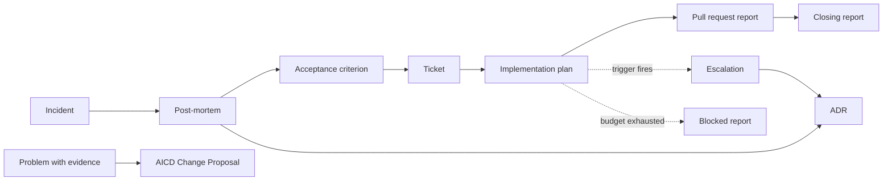

# templates: Ori Studio

The forms every plan, report, record, escalation and proposal in this product is written in. `CLAUDE.md` binds them: plans, reports, blocked reports and escalations follow the templates under `templates/`, and free prose outside those templates is not stored.

`templates/` sits at the repository root, beside `spec/`, `methodology/`, `ops/`, `profiles/` and `fixtures/`. `spec/LLD.md` section 1 places it there and describes it as "methodology templates shipped with Ori Studio (documents, roles, tickets, ACP)".

## What this directory is

Organizational knowledge, shipped with the product. AICD §34 names `templates/` as a path in the reference organizational repository, holding the ticket, pull request report, acceptance criterion, ADR, blocked report, post-mortem, escalation, Change Proposal and calibration record. No organizational repository exists yet, so Ori Studio carries these in-product as the shipped methodology defaults. `spec/RISK_MAP.md` tiers `templates/, profiles/` at 1 with the reason "Shipped methodology defaults", and `spec/PROJECT_BRIEF.md` section 3 states that Ori Studio ships the methodology as defaults, the specification templates among them.

What the specification says about the organizational layer: PRD A-06 defines the layer 2 repository as "configured once and read by every project", and PRD D-10 requires this set to be "editable at organizational level". So an organization overrides these files at organizational level and the product ships the defaults it overrides.

What the specification does not say: that the product's copies are removed once an organizational repository exists. Nothing in `spec/` states that, and `spec/RISK_MAP.md` carries its entry for this directory with no expiry and no phase condition. Nor does it state how an override resolves against a shipped default, whether by replacing the directory, by file-level precedence, or by merge. PRD A-06 and D-10 are where that would be decided, and neither decides it today.

These files are forms, not guidance documents. Each states what it is, when it is used, the methodology it comes from, its fields with their requiredness, and a blank form to copy.

## The ten templates

| File | Artifact | Source | Verbatim or derived |
|---|---|---|---|
| `acceptance-criterion.md` | Acceptance criterion | AICD appendix A.1 | Verbatim, field for field; one note below the form, marked as not from A.1 |
| `ticket.md` | Ticket | AICD appendix A.2 | Verbatim, field for field; three rules below the form, cited to AICD §39 and AICD §11 |
| `pull-request-report.md` | Pull request report | AICD appendix A.3 | Verbatim, field for field |
| `adr.md` | Architecture decision record | AICD appendix A.4 | Verbatim, field for field |
| `blocked-report.md` | Blocked report | AICD appendix A.5 | Verbatim, field for field; one note below the form, marked as not from A.5 |
| `plan.md` | Implementation plan | AICD §10, §11, §12 | Derived |
| `closing-report.md` | Closing report | AICD §8, §25 | Derived |
| `escalation.md` | Escalation | AICD §12, plus one trigger this product derives from AICD §39 | Derived |
| `post-mortem.md` | Post-mortem | AICD §16 | Derived |
| `change-proposal.md` | AICD Change Proposal | AICD §29 | Derived |

The five verbatim templates add no field the methodology does not name. The five derived templates exist because `CLAUDE.md` and PRD D-10 require them and appendix A has no entry for them; each names in its header the sections its fields come from, and says that it is derived, so a reader can check the derivation and the citation gate can check the references.

## Where each one appears

## Rules

- Changing a template is a parameter or extension change, never a silent edit. AICD §29 makes a new document type an extension, so a new template needs a Change Proposal. AICD §29 does not name an edit to an existing template; the nearest rule it states is AICD §32's, that changing an instruction file is a parameter or extension change under §29. Templates sit in the same organizational layer as instruction files (AICD §34 lists both under the organizational repository), so this directory follows §32's rule until the methodology states one of its own.
- Every methodology reference in these files must resolve. `spec/CONVENTIONS.md` states the rule as `AICD §<n>`. Files here also cite appendix entries as `AICD appendix A.<n>`, the form already used in `spec/criteria/phase-1.md` and `spec/README.md`, because appendix A carries letters and not section numbers. Which forms the citation gate accepts is settled with the machine-readable section index, not in this directory.
- A fabricated reference is what AICD §39 requires mechanical checking for: four drafting agents produced eleven fabricated section references, one of which would have removed a required check, and the rule adopted is that a checker validates every reference in specification, operational memory and instruction files, with the drafting-error rate as a calibration metric. The one defect class §39 names is a different lesson, "present but reporting nothing", about a control that is in place and reports nothing.
- Fields marked required are filled or the artifact is not submitted. `none` is a valid value only where the requiredness column says so.
- Operational records go through the report tools, never by hand-editing `ops/` (`CLAUDE.md`).

## Not present

This directory holds the ten templates above. `spec/README.md`'s row for `templates/` scopes batch 1 of phase 1 to exactly those ten. Four further kinds of template are named by the methodology or by the specification and are not here.

| Not here | Named by | What is known about when it arrives |
|---|---|---|
| Calibration record | The AICD §34 list | AICD §30 defines the calibration procedures but no record format. PRD C-01 schedules calibration runs with recorded medians for phase 2, and `spec/ROADMAP.md` lists "calibration records" among phase 2 deliveries. The fields are not knowable before that function exists. |
| Document templates (the foundation set and the phase set) | `spec/LLD.md` section 1 ("documents"), PRD D-10 ("every document kind", phase 1), `spec/agents/assistant.md`, which drafts those sets "from the templates under `templates/`" | Required by a phase 1 function and by a phase 1 role file, and not written by this batch. No document in `spec/` states which batch writes them. |
| Role template | `spec/LLD.md` section 1 ("roles") | AICD §34 places the role template under `roles/`, not under `templates/`, while `spec/LLD.md` puts role templates here. The two do not agree and neither this directory nor a ticket resolves it. The six role files exist under `spec/agents/`; the template they derive from does not. |
| Persona template | PRD D-10 ("persona") | `spec/README.md` schedules `criteria/personas.md` for phase 3 and marks it "not needed before phase 3". |

The absences are not defects of this batch. They are recorded here so that this README is not read as a complete inventory of what `templates/` will hold.
